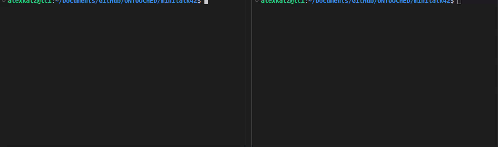

# Minitalk

A client-server communication project from 42 School that transmits messages between processes using only UNIX signals.

## Signals permitted

The following UNIX signals are used for communication:

- `SIGUSR1` -> **Binary 0** - Represents bit value 0 in message transmission;
- `SIGUSR2` -> **Binary 1** - Represents bit value 1 in message transmission;

## Table of Contents

- [Algorithm](#algorithm)
- [Project Structure](#project-structure)
- [Installation](#installation)
- [Usage](#usage)
- [Testing](#testing)
- [Demo](#demo)

## Algorithm

The program uses bit-by-bit signal transmission to send messages:

- **Signal encoding**: Each character (8 bits) is sent one bit at a time
- **SIGUSR1**: Represents binary 0
- **SIGUSR2**: Represents binary 1
- **Character reconstruction**: Server receives 8 signals and rebuilds the character
- **Message assembly**: Characters are concatenated until null terminator is received

**Example transmission of 'A' (ASCII 65 = 0b01000001):**
```
Bit 7 → SIGUSR1 (0)
Bit 6 → SIGUSR2 (1)
Bit 5 → SIGUSR1 (0)
Bit 4 → SIGUSR1 (0)
Bit 3 → SIGUSR1 (0)
Bit 2 → SIGUSR1 (0)
Bit 1 → SIGUSR1 (0)
Bit 0 → SIGUSR2 (1)
```

## Project Structure

```
minitalk42/
├── assets/
│   └── minitalk.gif            # Demo animation
├── include/
│   └── minitalk.h              # Project header
├── libft/                      # Custom C library
│   ├── ft_printf/              # Printf implementation
│   ├── strings/                # String manipulation
│   ├── memory/                 # Memory functions
│   ├── strtoint/               # Conversion functions
│   ├── puts/                   # Output functions
│   ├── libft.h                 # Library header
│   ├── libft.a                 # Compiled library (after make)
│   └── Makefile
├── srcs/
│   ├── mandatory/
│   │   ├── server.c            # Server program
│   │   └── client.c            # Client program
│   └── bonus/
│       ├── server_bonus.c      # Server with acknowledgment
│       └── client_bonus.c      # Client with acknowledgment
├── Makefile                    # Build configuration
└── README.md                   # This file
```

## Installation

### Prerequisites
- GCC or Clang compiler
- Make
- Libc

### Compile

```bash

# Compile minitalk
make

# Compile bonus (with acknowledgment)
make bonus
```

This will create two executables:
- `server` - The server program that receives messages
- `client` - The client program that sends messages

## Usage

### Server

**Terminal 1 - Start the server:**

```bash
./server
```

**Output:**
```
Server PID: 12345
```

### Client

**Terminal 2 - Send a message:**

```bash
./client [SERVER_PID] "message"
```

**Examples:**

```bash
# Simple message
./client 12345 "Hello, World!"
```
**Output:**
Server terminal displays:
```
Hello, World!
```

#### Error handling
The program outputs `Error` and exits for:
- Invalid PID (non-numeric or negative)
- Wrong number of arguments
- Empty message string
- Server not found (signal fails)

```bash
# These should all output "Error"
./client abc "message"      # Invalid PID
./client 12345              # Missing message
./client                    # Missing arguments
```

### Bonus

The **bonus** version adds bi-directional communication with acknowledgment:

```bash
./client [SERVER_PID] "message"
```

**Output:**
Server acknowledges receipt, client displays confirmation:
```
Message received and acknowledged!
```

**Example:**

```bash
# Bonus with acknowledgment
./client 12345 "Hello with confirmation!"
```

## Testing

### Quick Tests

```bash
# Start server and get PID
./server &
SERVER_PID=$!

# Test simple message
./client $SERVER_PID "Test message"

# Test long message
./client $SERVER_PID "Lorem ipsum dolor sit amet, consectetur adipiscing elit"

# Test special characters
./client $SERVER_PID "!@#$%^&*()_+-=[]{}|"
```

## Demo

Watch the minitalk program in action, demonstrating client-server signal communication:

<table>
	<tr>
		<td width="40%">
			
		<td width="60%">
			<b>What you're seeing in the demo:</b>
			<ul>
				<li>Server starts and displays its PID</li>
				<li>Client sends messages character by character using signals</li>
				<li>Server receives and reconstructs the message bit by bit</li>
				<li>Message appears on server terminal in real-time!</li>
			</ul>
		</td>
	</tr>
</table>
